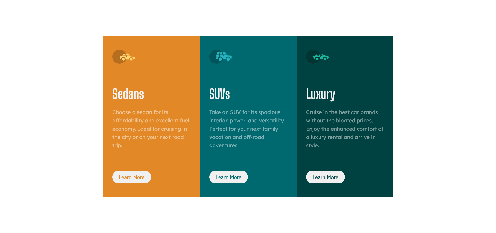

# Frontend Mentor - 3-column preview card component solution

This is a solution to the [3-column preview card component challenge on Frontend Mentor](https://www.frontendmentor.io/challenges/3column-preview-card-component-pH92eAR2-).

## Table of contents

- [Overview](#overview)
  - [The challenge](#the-challenge)
  - [Screenshot](#screenshot)
  - [Links](#links)
- [My process](#my-process)
  - [Built with](#built-with)
  - [Continued development](#continued-development)
- [Author](#author)

## Overview

A simple three card layout that is responsive, and built with Mobile first approach!

### The challenge

Users should be able to:

- View the optimal layout depending on their device's screen size
- See hover states for interactive elements

### Screenshot

### Links

- Solution URL: [Add solution URL here](https://github.com/rrgmon/frontendmentor-challenge-newbie-2)
- Live Site URL: [Add live site URL here](https://rrgmon.dev/frontendmentor-challenge-newbie-2/)

## My process

Started with mobile first design, set everything right and then moved to the desktop version of the site.

### Built with

- Semantic HTML5 markup
- CSS custom properties
- Flexbox
- Mobile-first workflow

### Continued development

I still need to figure out how to use widths and heights, and how they are inherited. Spent too much time with adjusting those values.

## Author

- Website - [Rohit Regimon](https://rrgmon.dev)
- Frontend Mentor - [@rrgmon](https://www.frontendmentor.io/profile/rrgmon)
- Twitter - [@rohitregimon](https://www.twitter.com/rohitregimon)
